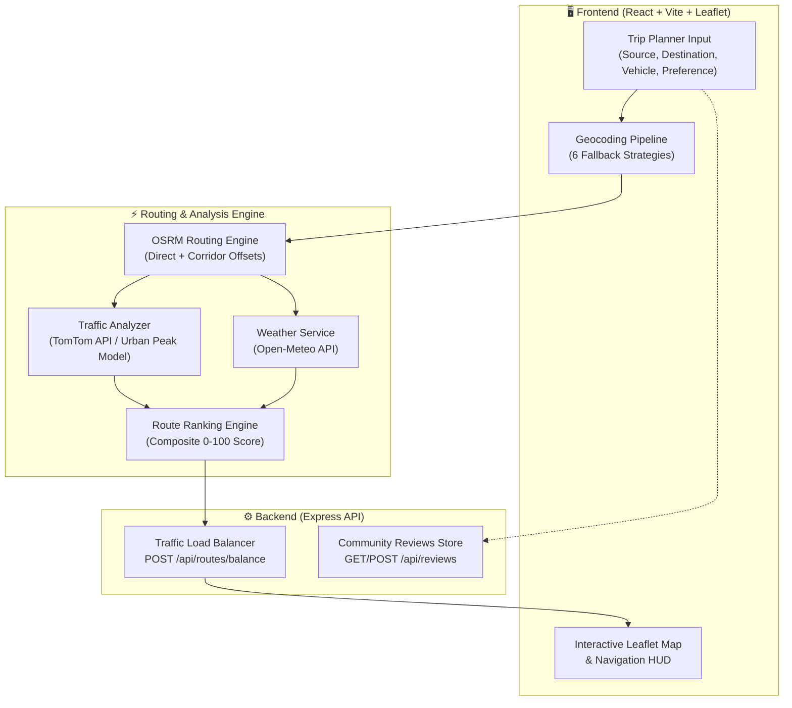

<div align="center">

```text
  ███████╗██╗      ██████╗ ██╗    ██╗██╗  ██╗
  ██╔════╝██║     ██╔═══██╗██║    ██║╚██╗██╔╝
  █████╗  ██║     ██║   ██║██║ █╗ ██║ ╚███╔╝ 
  ██╔══╝  ██║     ██║   ██║██║███╗██║ ██╔██╗ 
  ██║     ███████╗╚██████╔╝╚███╔███╔╝██╔╝ ██╗
  ╚═╝     ╚══════╝ ╚═════╝  ╚══╝╚══╝ ╚═╝  ╚═╝
```

### 🚦 Intelligent Urban Mobility & Traffic Distribution Platform

[](https://react.dev/)
[](https://vitejs.dev/)
[](https://nodejs.org/)
[](https://expressjs.com/)
[](https://leafletjs.com/)
[](https://www.openstreetmap.org/)
[](LICENSE)

<p align="center">
  <b>FlowX goes beyond traditional navigation.</b><br>
  Instead of funneling all vehicles onto a single congested highway, FlowX dynamically models urban traffic corridors, evaluates live weather and safety parameters, and distributes traffic across optimal alternatives to actively de-congest modern cities.
</p>

---

</div>

## 🗺️ System Architecture



---

## ✨ Features Matrix

| Category | Status | Capability | Description |
|:---|:---:|:---|:---|
| **Planning** | ✅ | **Trip Planner** | Point-to-point journey planning with vehicle profile selection |
| **Waypoints** | ✅ | **Multi-Stop Routing** | Add, remove, and optimize intermediate stops along the route |
| **Mapping** | ✅ | **Interactive Map** | Double-click to place markers, hold-and-drag to pan smoothly |
| **Context Menu** | ✅ | **Map Click Actions** | Right-click anywhere to set start or destination coordinates |
| **GPS** | ✅ | **Live Geolocation** | Continuous real-time user location tracking via GPS API |
| **Alternatives** | ✅ | **Corridor Offsets** | Generates up to 5 alternative corridors to prevent bottlenecks |
| **Scoring** | ✅ | **Multi-Criteria Ranking** | Scores routes based on travel time, distance, traffic, weather, and safety |
| **Live Traffic** | ✅ | **TomTom + Peak Model** | Real-time traffic flow segments with an urban time-of-day model fallback |
| **Weather** | ✅ | **Open-Meteo Integration** | Live temperature, humidity, wind, and WMO weather condition adjustments |
| **Pedestrian Safety**| ✅ | **Night Safety Mode** | Auto-activates 8 PM – 6 AM for pedestrians to avoid deserted backstreets |
| **Distribution** | ✅ | **Traffic Load Balancing** | Server-side flattening algorithm calculates balanced traffic load |
| **HUD** | ✅ | **Turn-by-Turn Simulator**| Virtual driving/walking simulation with heads-up display |
| **Sustainability** | ✅ | **CO₂ Estimator** | Estimates grams of carbon emissions per route based on vehicle profile |
| **Discovery** | ✅ | **POI Exploration** | Discovers nearby hospitals, fuel stations, police booths, and parking |
| **Community** | ✅ | **Route Reviews** | Read and submit user reviews for specific urban corridors |
| **Layers** | ✅ | **Custom Map Layers** | Switch between CARTO Light/Dark, OpenStreetMap, and Esri Satellite |

---

## 🛠️ Tech Stack & Services

### Core Technologies
```text
┌─────────────────────────┬─────────────────────────┬─────────────────────────┐
│        FRONTEND         │         BACKEND         │       PERSISTENCE       │
├─────────────────────────┼─────────────────────────┼─────────────────────────┤
│ • React 18              │ • Node.js (v18+)        │ • reviews.json          │
│ • Vite 5                │ • Express 4             │ • Flat-file disk cache  │
│ • Leaflet 1.9           │ • CORS Middleware       │ • Zero DB requirement   │
│ • Pure CSS3 Design      │ • RESTful API Design    │ • In-memory fallback    │
└─────────────────────────┴─────────────────────────┴─────────────────────────┘
```

### External APIs & Data Providers

| Provider | Purpose | Type | Rate Limits / Key Required |
|:---|:---|:---:|:---|
| **OSRM** | Multi-route pathing & geometry | REST | ✅ Open-source / Free public server |
| **Nominatim** | Forward & reverse geocoding | REST | ⚠️ Free with rate limits (1 req/sec) |
| **Photon (Komoot)** | Real-time address autocomplete | REST | ⚠️ Free public service (OpenStreetMap data) |
| **Overpass API** | Points of Interest (POI) queries | Query API | ⚠️ Free public service (India-scoped) |
| **Open-Meteo** | Live weather & severity codes | REST | ✅ Free for non-commercial use, **No API key needed** |
| **TomTom Traffic** | Live flow segment speeds & congestion | REST | ✅ Free tier (2,500 free calls/day, API key required) |

---

## ⚡ Quick Start

### Prerequisites
* **Node.js**: `v18.0.0` or higher
* **npm**: `v9.0.0` or higher

```bash
# 1. Clone the repository
git clone https://github.com/your-username/FlowX.git
cd FlowX

# 2. Install root and workspace dependencies
npm install
npm run install:all
```

### 3. Environment Configuration

```bash
# Create local frontend environment file
cp frontend/.env.example frontend/.env
```

Edit `frontend/.env` to configure your endpoints and keys:

```ini
# FlowX Backend API Endpoint
VITE_BACKEND_URL=http://localhost:5000

# TomTom Traffic API Key (Optional — fallback urban model activates if left blank)
VITE_TOMTOM_API_KEY=your_tomtom_api_key_here
```

> [!TIP]
> You can acquire a free TomTom API key at [developer.tomtom.com](https://developer.tomtom.com) with 2,500 daily requests.

### 4. Run Development Servers

```bash
npm run dev
```

```text
┌────────────────────────────────────────────────────────────┐
│                  FlowX Services Running                    │
├───────────────┬────────────────────────────────────────────┤
│ Frontend App  │  http://localhost:5173                     │
│ Backend API   │  http://localhost:5000                     │
│ Health Check  │  http://localhost:5000/api/health          │
└───────────────┴────────────────────────────────────────────┘
```

---

## 🚀 Available Scripts

Run from the **project root**:

| Command | Action |
|:---|:---|
| `npm run dev` | Runs **both** Frontend (Vite) and Backend (Express) concurrently |
| `npm run frontend` | Starts only the Vite frontend dev server |
| `npm run backend` | Starts only the Express backend server |
| `npm run install:all` | Performs clean install across root, `frontend/`, and `backend/` |
| `npm run build` | Compiles frontend for production into `frontend/dist/` |

---

## 🗂️ Project Structure

```text
FlowX/
├── package.json                         # Root runner (concurrently orchestration)
├── README.md                            # Complete documentation
├── PROJECT_CONTEXT.md                   # Vision and system design notes
│
├── backend/                             # Express REST API Server
│   ├── server.js                        # Endpoints: /health, /routes/balance, /reviews
│   ├── reviews.json                     # Flat-file store for community reviews
│   ├── Procfile                         # Render cloud deployment specification
│   ├── package.json                     # Backend dependencies (express, cors)
│   └── README.md                        # Backend service documentation
│
└── frontend/                            # React + Vite Client Application
    ├── index.html                       # HTML5 Shell with custom favicon & meta
    ├── vite.config.js                   # Vite bundler configuration
    ├── .env.example                     # Environment variable blueprint
    ├── package.json                     # Frontend dependencies (leaflet, lucide-react)
    └── src/
        ├── main.jsx                     # Client bootstrap entrypoint
        ├── App.jsx                      # Master coordinator (Form, Map & State)
        ├── App.css                      # Master layout and animations
        ├── index.css                    # Design tokens (Dark/Light mode, colors, typography)
        ├── leafletSetup.js              # Leaflet asset and icon bundle fixes
        │
        ├── services/                    # Business Logic & External Data Integration
        │   ├── routing.js               # 6-tier geocoding + OSRM corridor generation
        │   ├── routeRanking.js          # Multi-criteria scoring & ranking engine
        │   ├── traffic.js               # TomTom live flow + urban peak-hour model
        │   ├── weather.js               # Open-Meteo weather parser & WMO translator
        │   ├── autocomplete.js          # Typeahead search (Photon + Nominatim)
        │   └── poi.js                   # Nearby Places of Interest (Overpass)
        │
        ├── utils/
        │   └── routeColors.js           # Route color schemes and polyline palettes
        │
        └── components/                  # Modular React UI Components
            ├── Navbar.jsx / .css        # Top header, brand branding, theme toggle
            ├── TripPlanner.jsx / .css   # Form, vehicle selectors, GPS toggle
            ├── FlowMap.jsx / .css       # Leaflet map, polylines, layer controls
            ├── RouteList.jsx / .css     # Scored route cards & breakdowns
            ├── LocationInput.jsx / .css # Autocomplete dropdown with geocoding
            ├── WeatherWidget.jsx / .css # Current weather indicator
            ├── TrafficWidget.jsx / .css # Congestion summary and peak indicator
            ├── NavSimulatorHUD.jsx/.css # Turn-by-turn navigation simulation HUD
            ├── CommunityReviewsModal.jsx# Community route rating & feedback modal
            └── ErrorBoundary.jsx        # Component failure protection boundary
```

---

## 🧠 How It Works: Deep Dive

### 1. The 6-Strategy Geocoding Pipeline

FlowX ensures zero search failures through a hierarchical fallback mechanism:

```text
  ┌─────────────────────────────────────────────────────────────┐
  │                 User Input (Address or Place)               │
  └──────────────────────────────┬──────────────────────────────┘
                                 │
                                 ▼
   [Tier 1] ───► Pre-geocoded Coordinates passthrough?  ───(Yes)───► [ Coordinates ]
                                 │ (No)
                                 ▼
   [Tier 2] ───► Raw Lat/Lon Regex ("19.07, 72.87")?   ───(Yes)───► [ Coordinates ]
                                 │ (No)
                                 ▼
   [Tier 3] ───► Nominatim Free-Text (India-scoped)?   ───(Yes)───► [ Coordinates ]
                                 │ (No)
                                 ▼
   [Tier 4] ───► Nominatim Structured Search?          ───(Yes)───► [ Coordinates ]
                                 │ (No)
                                 ▼
   [Tier 5] ───► Photon (Komoot) Fuzzy Search?         ───(Yes)───► [ Coordinates ]
                                 │ (No)
                                 ▼
   [Tier 6] ───► Overpass Global OSM Fallback?         ───(Yes)───► [ Coordinates ]
```

---

### 2. Multi-Route Generation (Corridor Offsets)

Traditional mapping apps display minor variations of the same major road. FlowX generates genuine alternative corridors using perpendicular offset vectors at 18% and 32% of the direct trajectory:

```text
                       ┌───────────────────────────────┐
                       │  Route 2: Left Offset (+18%)  │
                      ╱└───────────────────────────────┘╲
                     ╱                                   ╲
   [ ORIGIN ] ══════●════════ Route 1: Direct ════════════●══════> [ DESTINATION ]
                     ╲                                   ╱
                      ╲┌───────────────────────────────┐╱
                       │  Route 3: Right Offset (-18%) │
                       └───────────────────────────────┘
```

1. Computes the direct road trajectory via OSRM.
2. Calculates perpendicular offset coordinates at fractional distances.
3. Requests waypoint-snapped routes through these distinct corridors.
4. Deduplicates routes with excessive spatial or duration overlap.

---

### 3. Live Traffic Flow & Urban Congestion Model

Each route is evenly sampled across 5 points (`15%`, `35%`, `50%`, `70%`, `85%` of length):

```text
Route Polyline:  [Origin] ──•──────•──────•──────•──────•── [Destination]
Sample Points:             15%    35%    50%    70%    85%
```

* **Live Mode (TomTom)**: Queries `/traffic/services/4/flowSegmentData` for real-time speed vs free-flow speed.
* **Urban Model Fallback**: If TomTom is unconfigured or rate-limited, FlowX computes peak multipliers using local time:

| Time Window | Commute Stage | Weekday Factor | Weekend Factor | Traffic Flow Status |
|:---|:---|:---:|:---:|:---|
| **08:00 – 10:30** | Morning Rush Hour | **1.65×** | 1.00× | 🔴 High Congestion |
| **11:00 – 16:00** | Mid-Day Business | **1.30×** | 1.00× | 🟡 Moderate Traffic |
| **17:00 – 20:00** | Evening Rush Hour | **1.75×** | 1.00× | 🔴 Peak Congestion |
| **13:00 – 18:00** | Weekend Leisure | 1.00× | **1.25×** | 🟡 Weekend Traffic |
| **20:00 – 07:00** | Off-Peak / Night | **1.00×** | 1.00× | 🟢 Free Flow |

---

### 4. Real-time Weather Intelligence (Open-Meteo)

Weather data is fetched on-the-fly for the destination coordinates from **Open-Meteo**:
* **Parameters Retrieved**: `temperature_2m`, `relative_humidity_2m`, `wind_speed_10m`, and `weather_code`.
* **WMO Severity Categorization**:
  * `0` → Clear Sky ☀️
  * `1–3` → Partly Cloudy / Overcast ⛅
  * `45, 48` → Foggy 🌫️
  * `51–55` → Drizzle 🌦️ *(Minor penalty for two-wheelers)*
  * `61–65`, `80–82` → Rain / Showers 🌧️ *(Moderate penalty for non-enclosed vehicles)*
  * `95–99` → Thunderstorm ⛈️ *(Heavy penalty across all routes)*

---

### 5. Time of Day Calculation

FlowX evaluates time locally on the client machine via native JavaScript:

```javascript
const hour = new Date().getHours() // Integer: 0 to 23
```

This drives:
1. **Night Safety Trigger**: When `hour >= 20 || hour < 6` (8:00 PM – 5:59 AM).
2. **Peak Congestion Calculations**: Continuous time interpolation `hour + minutes / 60`.

---

### 6. Multi-Criteria Route Scoring & Preference Weights

Each route receives a composite score between **0 and 100** based on normalized sub-scores:

```text
┌─────────────────────────────────────────────────────────────────────────────┐
│                       WEIGHT ALLOCATION MATRIX                              │
├─────────────┬──────────┬──────────────┬──────────┬───────────┬──────────────┤
│ Preference  │   Time   │   Distance   │ Traffic  │  Weather  │ Night Safety │
├─────────────┼──────────┼──────────────┼──────────┼───────────┼──────────────┤
│ Fastest     │   50%    │     15%      │   25%    │    5%     │      5%      │
│ Balanced    │   30%    │     15%      │   25%    │   15%     │     15%      │
│ Normal      │   40%    │     25%      │   15%    │   10%     │     10%      │
│ Safest      │   15%    │     10%      │   20%    │   15%     │     40%      │
└─────────────┴──────────┴──────────────┴──────────┴───────────┴──────────────┘
```

Visual distribution of priorities:

```text
Fastest   [████████████████████ 50% Time] [██████████ 25% Traf] [15% Dist] [10% Other]
Balanced  [████████████ 30% Time] [██████████ 25% Traf] [15% Dist] [15% Wtr] [15% Safe]
Normal    [████████████████ 40% Time] [██████████ 25% Dist] [15% Traf] [20% Other]
Safest    [████████████████ 40% Safe] [████████ 20% Traf] [15% Time] [15% Wtr] [10% Dist]
```

---

### 7. Pedestrian Night Safety Mode

```mermaid
flowchart TD
    Start([User selects Walking]) --> CheckTime{Local Time Check\n`hour >= 20 || hour < 6`}
    CheckTime -->|Daytime 6:00 AM - 7:59 PM| DayMode[Day Mode Available\nPreferences: Normal\nSuggests fastest + 1 alternative]
    CheckTime -->|Nighttime 8:00 PM - 5:59 AM| NightMode[Night Safety Active\nDefault Preference: Safest Mode]
    NightMode --> UserChoice{User Overrides Preference?}
    UserChoice -->|Keeps 'Safest'| CuratedSafe[Presents 1 Curated Safe Route\n• Avoids deserted alleys\n• Prioritizes well-lit, active streets\n• Maximizes street presence score]
    UserChoice -->|Selects 'Normal'| NormalWalk[Presents Fastest Route\n• Ignores night safety penalties\n• Standard pedestrian pathing]
```

> [!IMPORTANT]
> **Night Safety Route Rule**: When in `Safest` mode, FlowX suppresses confusing alternative routes and presents **exactly 1 vetted, high-traffic pedestrian corridor** to ensure personal security.

---

## 🔌 Backend API Reference

Base Endpoint: `http://localhost:5000` (Local) or your deployed Render URL.

### 1. Health Monitor
```http
GET /api/health
```
```json
{
  "status": "ok",
  "app": "FlowX Intelligent Mobility Backend Server",
  "timestamp": "2026-09-10T00:00:00.000Z"
}
```

---

### 2. Route Traffic Load Balancer
```http
POST /api/routes/balance
Content-Type: application/json
```

**Payload:**
```json
{
  "routes": [
    { "id": "route-1", "score": 88 },
    { "id": "route-2", "score": 62 }
  ]
}
```

**Response (200 OK):**
```json
{
  "success": true,
  "congestionReductionPct": 21,
  "distribution": [
    { "routeId": "route-1", "percentage": 63 },
    { "routeId": "route-2", "percentage": 37 }
  ]
}
```

> [!NOTE]
> A **30% flattening factor** is applied to ensure secondary viable roads absorb traffic, preventing 100% saturation on the single primary road.

---

### 3. Community Route Reviews

#### Fetch Reviews
```http
GET /api/reviews
```
```json
{
  "success": true,
  "count": 3,
  "reviews": [
    {
      "id": "rev-1",
      "author": "Aarav Sharma",
      "city": "Mumbai",
      "route": "Bandra West ➔ BKC",
      "rating": 5,
      "vehicle": "four-wheeler",
      "comment": "The alternative corridor saved me 25 minutes during peak evening rush.",
      "createdAt": "2026-09-10T00:00:00.000Z"
    }
  ]
}
```

#### Submit a Review
```http
POST /api/reviews
Content-Type: application/json
```

```json
{
  "author": "Priya Iyer",
  "city": "Bengaluru",
  "route": "MG Road ➔ Koramangala",
  "rating": 4,
  "vehicle": "two-wheeler",
  "comment": "Great suggestions for avoiding the congested junction bottlenecks."
}
```

---

## 🌱 Environment Variables

| Variable | File | Required? | Description |
|:---|:---:|:---:|:---|
| `VITE_BACKEND_URL` | `frontend/.env` | **Yes** | Fully qualified URL of the Express backend (e.g., `http://localhost:5000`) |
| `VITE_TOMTOM_API_KEY`| `frontend/.env` | Optional | TomTom Traffic Flow API key. If omitted, internal model takes over |
| `PORT` | Backend environment | Optional | Port for the Express server (default: `5000`) |

---

## 🚀 Deployment Guide

```text
                      DEPLOYMENT TOPOLOGY
                      
   ┌───────────────────┐              ┌───────────────────┐
   │      VERCEL       │              │      RENDER       │
   │  (Frontend React) │ ───REST────► │ (Express Backend) │
   │                   │   Requests   │                   │
   └───────────────────┘              └───────────────────┘
```

### 1. Frontend on Vercel
1. Import the repository on [Vercel](https://vercel.com).
2. Set **Root Directory** to `frontend`.
3. Configure Environment Variables in the project settings:
   * `VITE_BACKEND_URL` = `https://your-flowx-backend.onrender.com`
   * `VITE_TOMTOM_API_KEY` = `your_tomtom_api_key`
4. Deploy! Vercel automatically runs `npm run build` using the Vite preset.

### 2. Backend on Render
1. Create a new **Web Service** on [Render](https://render.com).
2. Connect your repository and set **Root Directory** to `backend`.
3. Set **Build Command**: `npm install`
4. Set **Start Command**: `npm start`
5. The pre-packaged `Procfile` guarantees seamless process startup.

> [!NOTE]
> On Render's free tier, `reviews.json` resides on an ephemeral container. Reviews persist during normal operation but re-seed on container redeployments, eliminating database setup and maintenance.

---

## 📄 License

Distributed under the MIT License. Developed for intelligent urban commuting.

