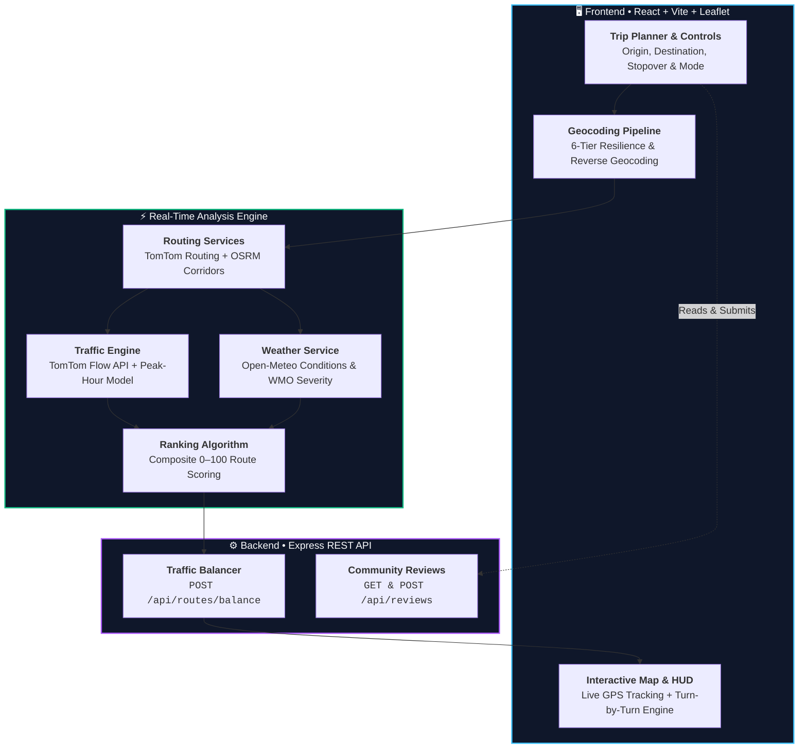
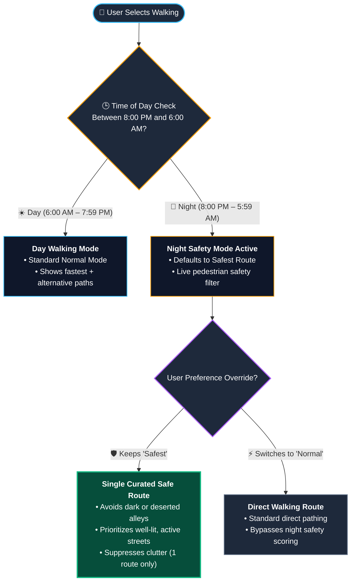

<div align="center">

```text
  ███████╗██╗      ██████╗ ██╗    ██╗██╗  ██╗
  ██╔════╝██║     ██╔═══██╗██║    ██║╚██╗██╔╝
  █████╗  ██║     ██║   ██║██║ █╗ ██║ ╚███╔╝ 
  ██╔══╝  ██║     ██║   ██║██║███╗██║ ██╔██╗ 
  ██║     ███████╗╚██████╔╝╚███╔███╔╝██╔╝ ██╗
  ╚═╝     ╚══════╝ ╚═════╝  ╚══╝╚══╝ ╚═╝  ╚═╝
```

### 🚦 Intelligent Urban Mobility & Traffic Distribution Platform

[](https://react.dev/)
[](https://vitejs.dev/)
[](https://nodejs.org/)
[](https://expressjs.com/)
[](https://leafletjs.com/)
[](https://www.openstreetmap.org/)
[](LICENSE)

<p align="center">
  <b>FlowX goes beyond traditional navigation.</b><br>
  Instead of funneling all vehicles onto a single congested highway, FlowX dynamically models urban traffic corridors, evaluates live weather and safety parameters, and distributes traffic across optimal alternatives to actively de-congest modern cities.
</p>

---

</div>

## 🗺️ System Architecture



---

## ✨ Features Matrix

| Category | Status | Capability | Description |
|:---|:---:|:---|:---|
| **Planning** | ✅ | **Trip Planner** | Point-to-point journey planning with vehicle profile selection (🚗 Car, 🛵 Bike, 🚶 Walk) |
| **Waypoints** | ✅ | **Multi-Stop Routing** | Add, remove, and optimize intermediate stopovers along the route |
| **Mapping** | ✅ | **Interactive Map** | Double-click to place markers, drag-to-pan, custom popups, and bounds auto-fitting |
| **Context Menu** | ✅ | **Map Click Actions** | Click anywhere on the map to set origin, destination, or stopover coordinates |
| **GPS** | ✅ | **Live Geolocation** | Continuous real-time user location tracking with speed (km/h), heading, and accuracy |
| **Live Navigation**| ✅ | **Live GPS Navigation** | Google Maps-style navigation with polyline snapping, live speed, and auto camera follow |
| **Simulation** | ✅ | **Route Simulator** | Virtual navigation simulator with pause/resume, speed multipliers (1×–8×), and progress bar |
| **Turn-by-Turn** | ✅ | **Maneuver Guidance** | Detailed turn-by-turn steps accessible inside the Navigation HUD and route cards |
| **Alternatives** | ✅ | **Corridor Offsets** | Generates distinct alternative corridors via offset vectors to prevent bottlenecks |
| **Scoring** | ✅ | **Multi-Criteria Ranking** | Scores routes based on travel time, distance, traffic congestion, weather, and safety |
| **Live Traffic** | ✅ | **TomTom + Peak Model** | Real-time traffic flow segment speeds with an urban peak-hour model fallback |
| **Weather** | ✅ | **Open-Meteo Integration** | Live temperature, humidity, wind, and WMO weather condition severity adjustments |
| **Pedestrian Safety**| ✅ | **Night Safety Mode** | Auto-activates 8 PM – 6 AM for pedestrians to prioritize active, well-lit street traffic |
| **Distribution** | ✅ | **Traffic Load Balancing** | Server-side flattening algorithm calculates balanced traffic load across corridors |
| **Sustainability** | ✅ | **CO₂ Estimator** | Estimates grams of carbon emissions per route based on vehicle profile |
| **Community** | ✅ | **Route Reviews** | Read and submit localized community reviews and feedback for urban corridors |
| **GPX Export** | ✅ | **GPX Route Tracks** | One-click export of calculated routes into standard `.gpx` files for GPS devices |
| **Overlays** | ✅ | **Live Traffic Overlay** | Toggle real-time TomTom traffic congestion raster tiles and alternative route paths |

---

## 🛠️ Tech Stack & Services

### Core Technologies
```text
┌─────────────────────────┬─────────────────────────┬─────────────────────────┐
│        FRONTEND         │         BACKEND         │       PERSISTENCE       │
├─────────────────────────┼─────────────────────────┼─────────────────────────┤
│ • React 19              │ • Node.js (v18+)        │ • reviews.json          │
│ • Vite 6 / 8            │ • Express 4             │ • Flat-file disk cache  │
│ • Leaflet 1.9           │ • Python (FastAPI/Flask)│ • Zero DB requirement   │
│ • React-Leaflet 5       │ • CORS Middleware       │ • In-memory fallback    │
│ • Pure CSS3 Design      │ • RESTful API Design    │ • LocalStorage state    │
└─────────────────────────┴─────────────────────────┴─────────────────────────┘
```

### External APIs & Data Providers

| Provider | Purpose | Type | Rate Limits / Key Required |
|:---|:---|:---:|:---|
| **OSRM** | Multi-route pathing, geometry & maneuver step instructions | REST | ✅ Open-source / Free public server |
| **TomTom Routing & Traffic** | Live flow segment data, traffic delay calculations & raster flow tile overlay | REST | ✅ Free tier (2,500 free calls/day, API key required) |
| **Nominatim** | Forward & reverse geocoding with boundary filtering | REST | ⚠️ Free with rate limits (1 req/sec) |
| **Photon (Komoot)** | Real-time address autocomplete typeahead | REST | ⚠️ Free public service (OpenStreetMap data) |
| **Open-Meteo** | Live weather, temperature, humidity, wind & WMO severity codes | REST | ✅ Free for non-commercial use, **No API key needed** |
| **Overpass API** | Micro-radius name resolution fallback for precise OSM place queries | Query API | ⚠️ Free public service (India-scoped) |

---

## ⚡ Quick Start

### Prerequisites
* **Node.js**: `v18.0.0` or higher
* **npm**: `v9.0.0` or higher

```bash
# 1. Clone the repository
git clone https://github.com/your-username/FlowX.git
cd FlowX

# 2. Install root and workspace dependencies
npm install
npm run install:all
```

### 3. Environment Configuration

```bash
# Create local frontend environment file
cp frontend/.env.example frontend/.env
```

Edit `frontend/.env` to configure your endpoints and keys:

```ini
# FlowX Backend API Endpoint
VITE_BACKEND_URL=http://localhost:5000

# TomTom Traffic API Key (Optional — fallback urban model activates if left blank)
VITE_TOMTOM_API_KEY=your_tomtom_api_key_here
```

> [!TIP]
> You can acquire a free TomTom API key at [developer.tomtom.com](https://developer.tomtom.com) with 2,500 daily requests.

### 4. Run Development Servers

```bash
npm run dev
```

```text
┌────────────────────────────────────────────────────────────┐
│                  FlowX Services Running                    │
├───────────────┬────────────────────────────────────────────┤
│ Frontend App  │  http://localhost:5173                     │
│ Backend API   │  http://localhost:5000                     │
│ Health Check  │  http://localhost:5000/api/health          │
└───────────────┴────────────────────────────────────────────┘
```

---

## 🚀 Available Scripts

Run from the **project root**:

| Command | Action |
|:---|:---|
| `npm run dev` | Runs **both** Frontend (Vite) and Backend (Express) concurrently |
| `npm run frontend` | Starts only the Vite frontend dev server |
| `npm run backend` | Starts only the Express backend server |
| `npm run install:all` | Performs clean install across root, `frontend/`, and `backend/` |
| `npm run build` | Compiles frontend for production into `frontend/dist/` |

---

## 🗂️ Project Structure

```text
FlowX/
├── package.json                         # Root runner (concurrently orchestration)
├── README.md                            # Complete documentation
├── PROJECT_CONTEXT.md                   # Vision and system design notes
├── requirements.txt                     # Root Python dependency specification
│
├── backend/                             # REST API Server (Node.js & Python implementations)
│   ├── server.js                        # Primary Express server: /health, /routes/balance, /reviews
│   ├── app.py                           # Alternative Flask backend implementation
│   ├── main.py                          # Alternative FastAPI backend implementation
│   ├── reviews.json                     # Flat-file store for community reviews
│   ├── Procfile                         # Render cloud deployment specification
│   ├── package.json                     # Backend dependencies (express, cors)
│   ├── requirements.txt                 # Python backend dependencies
│   └── README.md                        # Backend service documentation
│
└── frontend/                            # React + Vite Client Application
    ├── index.html                       # HTML5 Shell with custom favicon & meta
    ├── vite.config.js                   # Vite bundler configuration
    ├── vercel.json                      # Vercel SPA routing configuration
    ├── .env.example                     # Environment variable blueprint
    ├── package.json                     # Frontend dependencies (leaflet, react-leaflet)
    └── src/
        ├── main.jsx                     # Client bootstrap entrypoint
        ├── App.jsx                      # Master coordinator (Form, Map & State)
        ├── App.css                      # Master layout and responsive styles
        ├── index.css                    # Design tokens (Dark/Light mode, colors, typography)
        ├── leafletSetup.js              # Leaflet asset and icon bundle fixes
        │
        ├── services/                    # Business Logic & External Data Integration
        │   ├── routing.js               # 6-tier geocoding + multi-route corridor generation
        │   ├── tomtomRouting.js         # TomTom traffic-aware routing & delay calculation
        │   ├── routeRanking.js          # Multi-criteria scoring & ranking engine
        │   ├── traffic.js               # TomTom live flow + urban peak-hour model
        │   ├── weather.js               # Open-Meteo weather parser & WMO translator
        │   ├── autocomplete.js          # Typeahead search (Photon + Nominatim)
        │   ├── useLiveLocation.js       # Geolocation watchPosition hook for live tracking
        │   └── poi.js                   # Overpass API POI helpers & micro-radius fallback
        │
        ├── utils/                       # Mathematical & Geodesic Utilities
        │   ├── geoNavEngine.js          # Geodesic navigation engine (snap-to-polyline, bearing)
        │   ├── gpxExport.js             # Route GPX file generator & download utility
        │   └── routeColors.js           # Route color schemes and polyline palettes
        │
        └── components/                  # Modular React UI Components
            ├── Navbar.jsx / .css        # Top header, branding, theme toggle & reviews button
            ├── TripPlanner.jsx / .css   # Journey form, vehicle selectors, GPS button
            ├── FlowMap.jsx / .css       # Leaflet map, polylines, overlays & layer controls
            ├── RouteList.jsx / .css     # Scored route cards, breakdowns & directions
            ├── LocationInput.jsx / .css # Autocomplete dropdown with geocoding
            ├── WeatherWidget.jsx / .css # Current destination weather indicator
            ├── TrafficWidget.jsx / .css # Congestion summary and peak indicator
            ├── NavSimulatorHUD.jsx/.css # Live navigation & turn-by-turn simulation HUD
            ├── CommunityReviewsModal.jsx# Community route rating & feedback modal
            └── ErrorBoundary.jsx        # Component failure protection boundary
```

---

## 🧠 How It Works: Deep Dive

### 1. The 6-Strategy Geocoding Pipeline

FlowX ensures zero search failures through a hierarchical fallback mechanism:

```text
  ┌─────────────────────────────────────────────────────────────┐
  │                 User Input (Address or Place)               │
  └──────────────────────────────┬──────────────────────────────┘
                                 │
                                 ▼
   [Tier 1] ───► Pre-geocoded Coordinates passthrough?  ───(Yes)───► [ Coordinates ]
                                 │ (No)
                                 ▼
   [Tier 2] ───► Raw Lat/Lon Regex ("19.07, 72.87")?   ───(Yes)───► [ Coordinates ]
                                 │ (No)
                                 ▼
   [Tier 3] ───► Nominatim Free-Text (India-scoped)?   ───(Yes)───► [ Coordinates ]
                                 │ (No)
                                 ▼
   [Tier 4] ───► Nominatim Structured Search?          ───(Yes)───► [ Coordinates ]
                                 │ (No)
                                 ▼
   [Tier 5] ───► Photon (Komoot) Fuzzy Search?         ───(Yes)───► [ Coordinates ]
                                 │ (No)
                                 ▼
   [Tier 6] ───► Overpass Micro-Radius / OSM Fallback? ───(Yes)───► [ Coordinates ]
```

> [!TIP]
> **User-Friendly Location Labels**: When users tap **"My Location"**, FlowX captures browser GPS fixes and executes reverse geocoding via Nominatim. If an address string is resolved, it displays the local place name; if only coordinates return, it cleanly presents `"Current Location"` instead of raw coordinates.

---

### 2. Multi-Route Generation & Corridor Offsets

Traditional mapping apps display minor variations of the same major road. FlowX generates genuine alternative corridors using TomTom traffic-aware alternatives and OSRM perpendicular offset vectors at 18% and 32% of the direct trajectory:

```text
                       ┌───────────────────────────────┐
                       │  Route 2: Left Offset (+18%)  │
                      ╱└───────────────────────────────┘╲
                     ╱                                   ╲
   [ ORIGIN ] ══════●════════ Route 1: Direct ════════════●══════> [ DESTINATION ]
                     ╲                                   ╱
                      ╲┌───────────────────────────────┐╱
                       │  Route 3: Right Offset (-18%) │
                       └───────────────────────────────┘
```

1. **TomTom Traffic-Aware Engine**: If a TomTom API key is configured and a motorized profile (`car`) is selected, FlowX queries TomTom's Calculate Route API with real-time delays and alternative routes (`maxAlternatives=3`).
2. **OSRM Corridor Offsets**: For open-source routing, FlowX computes direct road trajectory and calculates perpendicular offset coordinates at 18% and 32% fractional distances.
3. **Waypoint Snapping**: Requests waypoint-snapped routes through these distinct corridors to prevent bottlenecking.
4. **Intelligent Deduplication**: Automatically eliminates redundant route options with spatial overlap (< 250m difference) or duration overlap (< 40s difference).

---

### 3. Live Traffic Flow & Urban Congestion Model

Each route is evenly sampled across 5 points (`15%`, `35%`, `50%`, `70%`, `85%` of length):

```text
Route Polyline:  [Origin] ──•──────•──────•──────•──────•── [Destination]
Sample Points:             15%    35%    50%    70%    85%
```

* **Live Mode (TomTom)**: Queries `/traffic/services/4/flowSegmentData` for real-time speed vs free-flow speed and calculates estimated delay in minutes.
* **Urban Model Fallback**: If TomTom is unconfigured or rate-limited, FlowX computes peak multipliers using local time:

| Time Window | Commute Stage | Weekday Factor | Weekend Factor | Traffic Flow Status |
|:---|:---|:---:|:---:|:---|
| **08:00 – 10:30** | Morning Rush Hour | **1.65×** | 1.00× | 🔴 High Congestion |
| **11:00 – 16:00** | Mid-Day Business | **1.30×** | 1.00× | 🟡 Moderate Traffic |
| **17:00 – 20:00** | Evening Rush Hour | **1.75×** | 1.00× | 🔴 Peak Congestion |
| **13:00 – 18:00** | Weekend Leisure | 1.00× | **1.25×** | 🟡 Weekend Traffic |
| **20:00 – 07:00** | Off-Peak / Night | **1.00×** | 1.00× | 🟢 Free Flow |

---

### 4. Real-time Weather Intelligence (Open-Meteo)

Weather data is fetched on-the-fly for the destination coordinates from **Open-Meteo**:
* **Parameters Retrieved**: `temperature_2m`, `relative_humidity_2m`, `wind_speed_10m`, and `weather_code`.
* **WMO Severity Categorization**:
  * `0` → Clear Sky ☀️
  * `1–3` → Partly Cloudy / Overcast ⛅
  * `45, 48` → Foggy 🌫️
  * `51–55` → Drizzle 🌦️ *(Minor penalty for two-wheelers)*
  * `61–65`, `80–82` → Rain / Showers 🌧️ *(Moderate penalty for non-enclosed vehicles)*
  * `95–99` → Thunderstorm ⛈️ *(Heavy penalty across all routes)*

---

### 5. Time of Day Calculation

FlowX evaluates time locally on the client machine via native JavaScript:

```javascript
const hour = new Date().getHours() // Integer: 0 to 23
```

This drives:
1. **Night Safety Trigger**: When `hour >= 20 || hour < 6` (8:00 PM – 5:59 AM).
2. **Peak Congestion Calculations**: Continuous time interpolation `hour + minutes / 60`.

---

### 6. Multi-Criteria Route Scoring & Preference Weights

Each route receives a composite score between **0 and 100** based on normalized sub-scores:

```text
┌─────────────────────────────────────────────────────────────────────────────┐
│                       WEIGHT ALLOCATION MATRIX                              │
├─────────────┬──────────┬──────────────┬──────────┬───────────┬──────────────┤
│ Preference  │   Time   │   Distance   │ Traffic  │  Weather  │ Night Safety │
├─────────────┼──────────┼──────────────┼──────────┼───────────┼──────────────┤
│ Fastest     │   50%    │     15%      │   25%    │    5%     │      5%      │
│ Balanced    │   30%    │     15%      │   25%    │   15%     │     15%      │
│ Normal      │   40%    │     25%      │   15%    │   10%     │     10%      │
│ Safest      │   15%    │     10%      │   20%    │   15%     │     40%      │
└─────────────┴──────────┴──────────────┴──────────┴───────────┴──────────────┘
```

#### Route Presentation by User Preference:
* **Motorized Profiles (Four-Wheeler 🚗 & Two-Wheeler 🛵)**:
  * **Fastest**: Displays **strictly 1 route** (`⚡ Fastest Direct`) prioritizing minimal duration and lowest traffic delays.
  * **Balanced**: Displays **strictly 2 routes** (`🌟 Recommended Balanced Corridor` + `🌿 Smooth Traffic Alternative` / `⚡ Fastest Corridor`) to encourage decentralized traffic flow.
* **Pedestrian Profile (Walking 🚶)**:
  * **Safest (Night Mode 8 PM – 6 AM)**: Displays **strictly 1 vetted route** (`🌟 Recommended Safe Night Corridor`) prioritizing active street traffic and rejecting deserted alleys.
  * **Normal**: Displays **strictly 2 routes** (`⚡ Fastest Route` + `🌿 Alternative Route`).

---

### 7. Pedestrian Night Safety Mode



> [!IMPORTANT]
> **Night Safety Route Rule**: When in `Safest` mode, FlowX evaluates live street traffic activity (`trafficActivity >= 50`). Busy vehicular streets provide natural street lighting and surveillance. Deserted backstreets (`trafficActivity < 25`) receive heavy score penalties and visible alerts (`🚨 Deserted (No Traffic)`).

---

### 8. Live GPS Navigation & Turn-by-Turn Engine

FlowX offers a dual-mode navigation experience powered by `geoNavEngine.js`:

```text
  ┌─────────────────────────────────────────────────────────────┐
  │                    Navigation System                        │
  └──────────────┬──────────────────────────────┬───────────────┘
                 │ (Live GPS ON)                │ (Live GPS OFF / Demo)
                 ▼                              ▼
      [ Live GPS Navigation ]          [ Virtual Simulator ]
      • Continuous GPS tracking        • Play / Pause controls
      • Real-time polyline snapping    • Speed multipliers (1×–8×)
      • Dynamic speed (km/h) & ETA     • Synthetic progression
      • Smooth camera auto-follow      • Turn-by-turn preview
```

* **Live GPS Navigation**: True Google Maps-style navigation. As you travel, your position snaps to the route polyline using WGS84 geodesic projection. The camera follows your heading and position smoothly, dynamically displaying remaining distance and remaining duration while keeping the polyline ahead clear and unobstructed.
* **Virtual Route Simulation**: Available when GPS is off or for desktop demonstrations, allowing users to test routes at 1×, 2×, 4×, or 8× speeds with play/pause controls.
* **Integrated Steps HUD**: During active navigation, an integrated **"Steps"** button inside the HUD header allows instant inspection of all turn-by-turn maneuver instructions without pausing navigation.

---

## 🔌 Backend API Reference

Base Endpoint: `http://localhost:5000` (Local) or your deployed Render URL.

### 1. Health Monitor
```http
GET /api/health
```
```json
{
  "status": "ok",
  "app": "FlowX Intelligent Mobility Backend Server",
  "timestamp": "2026-09-10T00:00:00.000Z"
}
```

---

### 2. Route Traffic Load Balancer
```http
POST /api/routes/balance
Content-Type: application/json
```

**Payload:**
```json
{
  "routes": [
    { "id": "route-1", "score": 88 },
    { "id": "route-2", "score": 62 }
  ]
}
```

**Response (200 OK):**
```json
{
  "success": true,
  "congestionReductionPct": 21,
  "distribution": [
    { "routeId": "route-1", "percentage": 63 },
    { "routeId": "route-2", "percentage": 37 }
  ]
}
```

> [!NOTE]
> A **30% flattening factor** is applied to ensure secondary viable roads absorb traffic, preventing 100% saturation on the single primary road.

---

### 3. Community Route Reviews

#### Fetch Reviews
```http
GET /api/reviews
```
```json
{
  "success": true,
  "count": 3,
  "reviews": [
    {
      "id": "rev-1",
      "author": "Aarav Sharma",
      "city": "Mumbai",
      "route": "Bandra West ➔ BKC",
      "rating": 5,
      "vehicle": "four-wheeler",
      "comment": "The alternative corridor saved me 25 minutes during peak evening rush.",
      "createdAt": "2026-09-10T00:00:00.000Z"
    }
  ]
}
```

#### Submit a Review
```http
POST /api/reviews
Content-Type: application/json
```

```json
{
  "author": "Priya Iyer",
  "city": "Bengaluru",
  "route": "MG Road ➔ Koramangala",
  "rating": 4,
  "vehicle": "two-wheeler",
  "comment": "Great suggestions for avoiding the congested junction bottlenecks."
}
```

---

## 🌱 Environment Variables

| Variable | File | Required? | Description |
|:---|:---:|:---:|:---|
| `VITE_BACKEND_URL` | `frontend/.env` | **Yes** | Fully qualified URL of the Express backend (e.g., `http://localhost:5000`) |
| `VITE_TOMTOM_API_KEY`| `frontend/.env` | Optional | TomTom Traffic Flow API key. If omitted, internal model takes over |
| `PORT` | Backend environment | Optional | Port for the Express server (default: `5000`) |

---

## 🚀 Deployment Guide

```text
                      DEPLOYMENT TOPOLOGY
                      
   ┌───────────────────┐              ┌───────────────────┐
   │      VERCEL       │              │      RENDER       │
   │  (Frontend React) │ ───REST────► │ (Express Backend) │
   │                   │   Requests   │                   │
   └───────────────────┘              └───────────────────┘
```

### 1. Frontend on Vercel
1. Import the repository on [Vercel](https://vercel.com).
2. Set **Root Directory** to `frontend`.
3. Configure Environment Variables in the project settings:
   * `VITE_BACKEND_URL` = `https://your-flowx-backend.onrender.com`
   * `VITE_TOMTOM_API_KEY` = `your_tomtom_api_key`
4. Deploy! Vercel automatically runs `npm run build` using the Vite preset.

### 2. Backend on Render
1. Create a new **Web Service** on [Render](https://render.com).
2. Connect your repository and set **Root Directory** to `backend`.
3. Set **Build Command**: `npm install`
4. Set **Start Command**: `npm start`
5. The pre-packaged `Procfile` guarantees seamless process startup.

> [!NOTE]
> On Render's free tier, `reviews.json` resides on an ephemeral container. Reviews persist during normal operation but re-seed on container redeployments, eliminating database setup and maintenance.

---

## 📄 License

Developed for intelligent urban commuting. Free to use.

